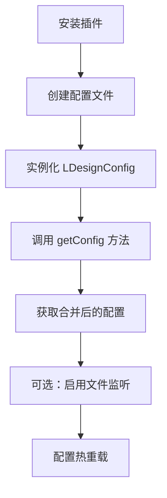

# LDesign Config - Node.js 配置加载插件产品需求文档

## 1. 产品概述

LDesign Config 是一个功能强大的 Node.js 配置加载插件，支持多种配置文件格式、环境配置管理和实时热重载功能。

该插件旨在为 Node.js 项目提供统一、灵活的配置管理解决方案，支持 TypeScript、JavaScript、JSON、YAML、JSON5 和环境变量等多种格式，并提供优秀的开发者体验和类型安全保障。

## 2. 核心功能

### 2.1 用户角色

| 角色 | 使用方式 | 核心权限 |
|------|----------|----------|
| 开发者 | npm/pnpm 安装使用 | 可以加载、监听和管理各种格式的配置文件 |

### 2.2 功能模块

我们的 ldesign-config 插件包含以下核心模块：

1. **配置加载器模块**：主要的 LDesignConfig 类，提供配置文件加载和管理功能
2. **多格式解析模块**：支持 .ts、.js、.json、.env、.yaml/.yml、.json5 等格式的解析器
3. **环境配置模块**：支持不同环境（dev、prod、test）的配置覆盖机制
4. **文件监听模块**：提供配置文件变更的实时监听和热重载功能
5. **类型定义模块**：提供 TypeScript 类型定义和 defineConfig 辅助函数
6. **工具函数模块**：提供配置合并、路径解析等辅助功能

### 2.3 页面详情

| 模块名称 | 功能名称 | 功能描述 |
|----------|----------|----------|
| 配置加载器模块 | LDesignConfig 类 | 实例化配置加载器，提供 getConfig() 方法获取指定环境配置 |
| 配置加载器模块 | 配置文件发现 | 根据命名规则自动发现和加载基础配置和环境配置文件 |
| 配置加载器模块 | 配置合并策略 | 实现环境配置覆盖基础配置的合并逻辑 |
| 多格式解析模块 | TypeScript 解析器 | 动态编译和加载 .ts 配置文件 |
| 多格式解析模块 | JavaScript 解析器 | 加载 .js 配置文件，支持 ES6 模块和 CommonJS |
| 多格式解析模块 | JSON 解析器 | 解析标准 JSON 和 JSON5 格式配置文件 |
| 多格式解析模块 | YAML 解析器 | 解析 .yaml 和 .yml 格式配置文件 |
| 多格式解析模块 | ENV 解析器 | 解析 .env 环境变量文件 |
| 环境配置模块 | 环境检测 | 自动检测当前运行环境（NODE_ENV）|
| 环境配置模块 | 配置优先级 | 实现环境配置 > 基础配置的优先级规则 |
| 文件监听模块 | 文件变更监听 | 使用 chokidar 监听配置文件变更 |
| 文件监听模块 | 热重载机制 | 配置文件变更时自动重新加载并触发回调 |
| 类型定义模块 | defineConfig 函数 | 为 TypeScript 配置文件提供类型提示和智能补全 |
| 类型定义模块 | 类型导出 | 导出完整的 TypeScript 类型定义 |
| 工具函数模块 | 深度合并 | 实现配置对象的深度合并功能 |
| 工具函数模块 | 路径解析 | 解析和规范化配置文件路径 |

## 3. 核心流程

**主要使用流程：**

1. 开发者通过 npm/pnpm 安装 ldesign-config 插件
2. 在项目中创建配置文件（如 ldesign.config.ts、ldesign.config.dev.ts）
3. 实例化 LDesignConfig 类，指定配置名称和选项
4. 调用 getConfig() 方法获取指定环境的配置
5. 可选择启用文件监听功能，实现配置热重载

## 4. 用户界面设计

### 4.1 设计风格

- **主色调**：现代蓝色 (#2563eb) 和深灰色 (#1f2937)
- **辅助色**：成功绿色 (#10b981)、警告橙色 (#f59e0b)、错误红色 (#ef4444)
- **代码风格**：使用 Fira Code 字体，支持连字符
- **文档布局**：简洁的卡片式布局，清晰的层级结构
- **图标风格**：使用 Lucide 图标库，简洁现代

### 4.2 页面设计概览

| 页面名称 | 模块名称 | UI 元素 |
|----------|----------|----------|
| README 文档 | 项目介绍 | 醒目的标题、功能特性列表、安装指南、使用示例代码块 |
| README 文档 | 快速开始 | 分步骤的安装和配置指南，带有代码高亮的示例 |
| README 文档 | API 文档 | 清晰的方法签名、参数说明、返回值类型 |
| VitePress 文档 | 导航菜单 | 侧边栏导航，包含快速开始、API 参考、示例等章节 |
| VitePress 文档 | 代码示例 | 语法高亮的代码块，支持复制功能 |
| VitePress 文档 | 类型定义 | 完整的 TypeScript 接口和类型说明 |

### 4.3 响应式设计

文档采用桌面优先的响应式设计，在移动设备上自动适配，提供良好的阅读体验。VitePress 文档支持暗色主题切换。